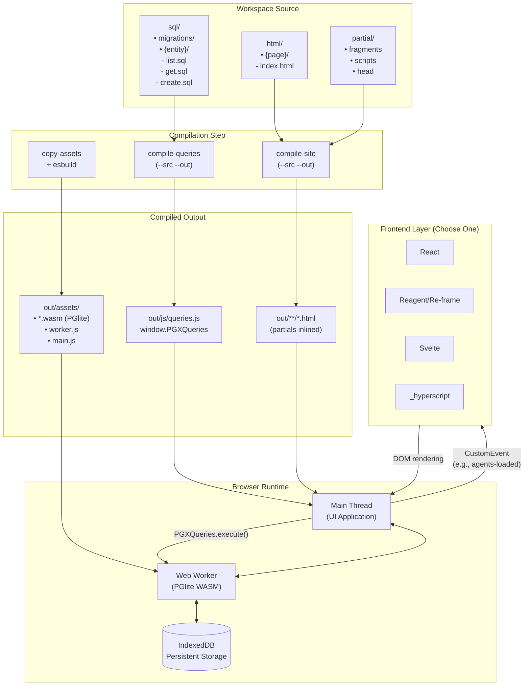

# forma-ui

> **Work in progress.** This is a functional but early-stage template. Notable missing features: integrated live reload, a proper CLI, and broader backend support. Some todos are noted along the way.

A template for building schema-driven UI applications backed by a PostgreSQL data model.

## Rationale

`forma-ui` proposes a declarative, data-model-driven approach for building data-intensive UI applications.

Data models are expressed in PostgreSQL SQL and compiled into clients the front-end can consume to interact with the database.

1. **Your data model lives in SQL.** Schema and queries are first-class source artifacts and are compiled into a typed, named query client available on `window.PGXQueries`.
2. **Your pages live in HTML templates.** The website is built from templates and served as a static artifact that can be easily hydrated on the client.
3. **You hydrate with whatever you like.** The compiled output is plain HTML. Wire it up with React, Reagent/Re-frame, Svelte, _hyperscript, or web components — all via the native `document` event system.

The result: the data model drives what operations exist, the HTML drives what pages exist, and your frontend library drives how the UI behaves.

---

## Architecture

`forma-ui` is built around a single concept: the **workspace**. A workspace is a folder containing your source artifacts — SQL queries and HTML templates. Two independent compilers read from it and write a deployable static site to an output directory. The runtime SQL client (PGlite, running in a Web Worker) is built separately and placed alongside the compiled output.

### Workspace

A workspace contains two subfolders and one convention:

- `sql/` — your data model: migrations and named queries, one file per operation.
- `html/` — your pages: templates that may reference reusable fragments.
- `partial/` — shared fragments (navigation, script tags, head metadata). Resolved relative to the workspace root, so they can be referenced from any page.

The suggested layout:

```
workspace/
├── sql/
│   ├── migrations/        # schema — CREATE TABLE, seed data
│   └── {entity}/          # named queries per entity
│       ├── list.sql
│       ├── get.sql
│       ├── create.sql
│       ├── update.sql
│       └── delete.sql
├── html/
│   └── {page}/
│       └── index.html
└── partial/
    └── *.html
```

The canonical examples are in `test-plan/` — each subdirectory (`test_1/`, `test_2/`, `test_3/`) is a self-contained workspace compiled and verified independently by the test suite.

> todo: add missing tests for test_3

### Compilers

Each compiler takes `--src <workspace>` and `--out <output-dir>` and reads only the subfolder it cares about. They are fully independent and can be pointed at the same workspace or at separate folders.

```
compile-queries --src <workspace> --out <out>
  reads:   workspace/sql/**/*.sql
  writes:  out/js/queries.js

compile-site --src <workspace> --out <out>
  reads:   workspace/html/**/*.html
           workspace/**  (for partial resolution)
  writes:  out/**/*.html  (mirrors html/ structure)

copy-assets --out <out>
  writes:  out/assets/*.wasm  (PGlite WASM files)

esbuild src/worker.js src/main.js
  writes:  out/assets/worker.js
           out/assets/main.js
```

---

## SQL compilation

Each `.sql` file in `workspace/sql/` becomes a named query. The key mirrors the file path without the extension:

```
sql/agents/create.sql  →  "agents/create"
sql/agents/list.sql    →  "agents/list"
```

Parameters are declared on the first line:

```sql
-- :params id name version tags description icon prompt
INSERT INTO agents (id, name, version, tags, description, icon, prompt)
VALUES ($1, $2, $3, $4::jsonb, $5, $6, $7)
RETURNING *;
```

Files without a parameter declaration take no arguments. All queries are compiled into `out/js/queries.js` as `window.PGXQueries` — a plain JSON object loaded as a script tag. 

> todo: sanitize input

---

## HTML compilation

Pages live in `workspace/html/`. Shared fragments are declared as partials:

```html
<head>
  <meta name="partial" content="partial/head.html" />
</head>
<body>
  ...
  <meta name="partial" content="partial/scripts.html" />
</body>
```

> todo: partials must be able to receive inputs at compile time 
> todo: inputs can be inlined or configured

`compile-site` resolves every `<meta name="partial">` directive inline and writes flat `.html` files to the output directory, preserving the folder structure. The compiled pages have no runtime dependency on the build system.

---

## Runtime SQL client

`src/main.js` and `src/worker.js` provide the in-browser SQL client. PGlite runs in a Web Worker to keep the main thread free.

**Initialise** once per page load, after running your migrations:

```js
await PGXQueries.init({ dataDir: 'idb://my-app' }, async (db) => {
  await db.exec(PGXQueries['migrations/001_init'].sql);
});
```

> todo: the template shall provide the primitive or a protocol for
>       versioning and migrating the schema preserving client's data 

**Execute** any named query by key, passing parameters by name:

```js
const list   = await PGXQueries.execute('agents/list');
const agent  = await PGXQueries.execute('agents/get',    { id: 'agt-001' });
const result = await PGXQueries.execute('agents/create', {
  id: 'agt-003', name: 'Planner', version: '1.0.0',
  tags: '["planning"]', description: 'Sequences goals into steps.',
  icon: 'account_tree', prompt: ''
});
```

Parameter order in the SQL file does not matter — the client maps names to positional `$1 $2 …` placeholders automatically.

---

## Example: agents entity

The `test_3` workspace provides a complete working example around an `agents` entity.

**Schema** (`sql/migrations/001_init.sql`):

```sql
CREATE TABLE agents (
  id          TEXT PRIMARY KEY,
  name        TEXT NOT NULL,
  version     TEXT NOT NULL DEFAULT '1.0.0',
  tags        JSONB NOT NULL DEFAULT '[]',
  created     TIMESTAMPTZ NOT NULL DEFAULT now(),
  updated     TIMESTAMPTZ NOT NULL DEFAULT now(),
  description TEXT NOT NULL DEFAULT '',
  icon        TEXT NOT NULL DEFAULT 'psychology',
  prompt      TEXT NOT NULL DEFAULT ''
);
```

**Queries** (`sql/agents/`): `list`, `get`, `create`, `update`, `delete` — each a standalone `.sql` file, each compiled into a named entry on `window.PGXQueries`.

**Page** (`html/index.html`): initialises the database, runs `agents/list`, and dispatches a `CustomEvent` with the results:

```html
<script type="module">
  await PGXQueries.init({ dataDir: 'idb://forma-test-3' }, async (db) => {
    await db.exec(PGXQueries['migrations/001_init'].sql);
    const result = await PGXQueries.execute('agents/list');
    document.dispatchEvent(new CustomEvent('agents-loaded', { detail: result.rows }));
  });
</script>
```

**UI layer:** this example interprets ClojureScript in the browser using [Scittle](https://github.com/babashka/scittle) to render a React application with Reagent and Re-frame. It listens for the `agents-loaded` event and renders the list:

```clojure
(ns agents
  (:require [reagent.dom :as rdom]
            [re-frame.core :as rf]))

(rf/reg-event-db ::set-agents
  (fn [db [_ agents]] (assoc db ::agents agents)))

(rf/reg-sub ::agents
  (fn [db _] (get db ::agents [])))

(defn agent-card [{:keys [id name version description tags]}]
  [:li {:key id}
   [:strong name] [:span " v" version]
   [:p description]
   [:div (for [tag tags] [:span {:key tag} tag])]])

(defn agents-view []
  (let [agents @(rf/subscribe [::agents])]
    (if (empty? agents)
      [:p "Loading…"]
      [:ul (for [a agents] ^{:key (:id a)} [agent-card a])])))

(.addEventListener js/document "agents-loaded"
  (fn [e]
    (rf/dispatch [::set-agents (js->clj (.-detail e) :keywordize-keys true)])))

(rdom/render [agents-view] (.getElementById js/document "app"))
```

The SQL layer and the UI layer share nothing but a browser event. Swap Reagent for React, Svelte, or anything else — the page and the queries do not change.

> todo: 
>  - tables and queries should be compiled to json-schema 
>  - add example json-schema to malli/spec, json-schema to typescript typings 

---

## Getting started

```bash
yarn install
# create your workspace (e.g. plan/) with sql/ and html/ subfolders, then:
yarn build          # compiles plan/ → public/
npx serve public
```

The scripts are not tied to `plan/` — pass any workspace:

```bash
node scripts/compile-queries.js --src my-workspace --out dist
node scripts/compile-site.js    --src my-workspace --out dist
```

---

## Build scripts

| Command | What it does |
|---|---|
| `yarn build:js` | Bundle `src/worker.js` and `src/main.js` with esbuild |
| `yarn copy-assets` | Copy PGlite WASM files to `out/assets/` |
| `yarn compile-site` | Compile HTML templates to `out/` |
| `yarn compile-queries` | Compile SQL files to `out/js/queries.js` |
| `yarn build` | Run all of the above |
| `yarn test` | Run Playwright tests |

---

## Backend options

The default backend is **PGlite** — PostgreSQL compiled to WASM, running entirely in the browser and persisting in IndexedDB. No server required.

The same SQL-first approach extends to real backends without changing the data model or the queries:

**PostgREST** — expose a real PostgreSQL database as a REST API and replace the PGlite client with HTTP calls, keeping the same named query conventions. See [postgrest.org](https://postgrest.org).

> todo: pgrest client (json-schema to http client)
> todo: docker-compose with pgrest 

**PGlite local-first with sync** — run PGlite in the browser as a local replica and sync with a real PostgreSQL instance via [ElectricSQL](https://electric-sql.com), enabling offline-capable apps with real-time updates.

The data model you write today is valid in all three cases.

---

## Testing

The project contains a minimal Playwright configuration for getting started.

Tests live in `tests/` and run against `test-public/` — a pre-compiled output used as a stable fixture. The test workspaces are in `test-plan/`.

Each workspace must be compiled into `test-public/` before running the tests. For example, to compile `test_3`:

```bash
node scripts/compile-site.js    --src test-plan/test_3 --out test-public/test_3
node scripts/compile-queries.js --src test-plan/test_3 --out test-public/test_3
```

Then run the full suite:

```bash
yarn test
```

## Current Architecture



